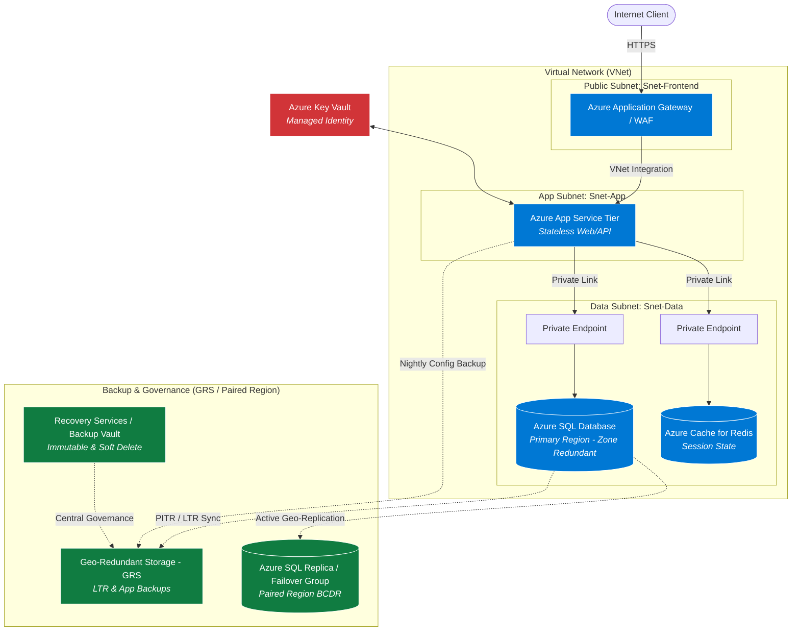
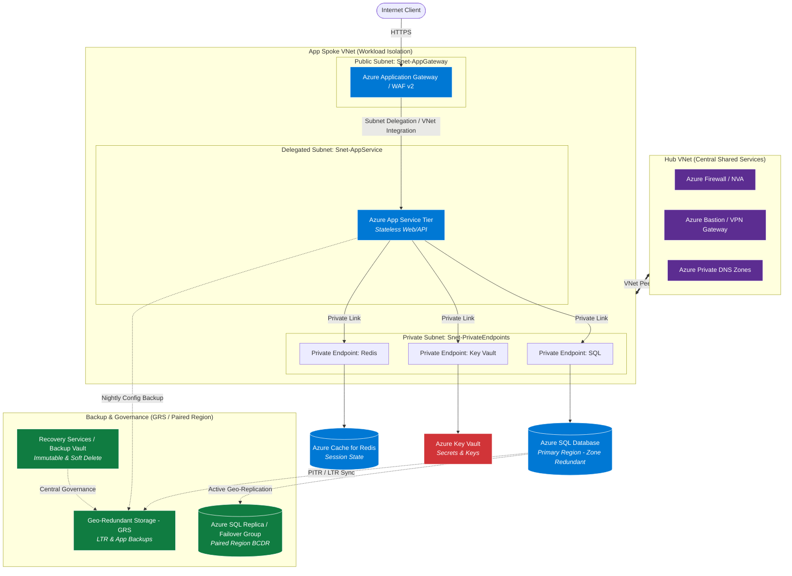

## 3-Tier Application with Backup & Recovery 
| Component | Option A: PaaS (App Service / Azure SQL) | Option B: IaaS (VM-based) |
|-----------|------------------------------------------|---------------------------|
| **Web Tier** | Azure App Service (Linux/Windows) | VMs behind Azure Application Gateway |
| **App Tier** | Azure App Service / Container Apps | VMs behind Internal Load Balancer (ILB) |
| **Data Tier** | Azure SQL Database / Azure Database for PostgreSQL | SQL Server / PostgreSQL on Azure VMs |
| **Management Overhead** | Very Low (Managed OS, automatic patching) | High (Manual OS/DB patching, backup management) |
| **Best For** | Modern web apps, low ops burden, auto-scaling | Legacy app migration, strict OS-level requirements |   

### High-Level 3-Tier PaaS Architecture
```
[ Internet Client ]
       │
       ▼
[ Azure Front Door / Application Gateway + WAF ] ────► Public Subnet (Snet-Frontend)
       │
       ▼ (VNet Integration / Private Endpoint)
[ Web / App Tier: Azure App Service ] ───────────────► App Subnet (Snet-App)
       │
       ▼ (Private Endpoint)
[ Data Tier: Azure SQL Database ] ───────────────────► Data Subnet (Snet-Data)
```


#### Detailed Design by WAF Pillars
###### 1. Network Topology & Security (Security & Reliability)
- ***Virtual Network (VNet) Segmentation***:
  - `Snet-App`: Subnet dedicated to App Service VNet Integration.
  - `Snet-Data`: Subnet with Private Endpoints for database access.
  - `Snet-Mgmt`: Optional subnet for Jumpbox/Bastion if accessing management interfaces.
- ***Traffic Control:***
  - `Network Security Groups (NSGs)`: Strict rules allowing inbound traffic only from the
  - `Application Gateway to Snet-App`, and from Snet-App to Snet-Data. Block all direct outbound
  - `internet access` where possible using NAT Gateway or User Defined Routes (UDRs).
- ***Private Link / Private Endpoints:***
  - Ensure Azure SQL and key storage accounts expose no public IP addresses.
- ***Key Management:***
  - Store all connection strings, secrets, and certificates in Azure Key Vault with Managed Identity access

###### 2. Backup & Disaster Recovery Strategy (Reliability)
- ***Database Tier (Azure SQL)***
  - `Automated Backups:`
     - Point-in-Time Restore (PITR): Retention configured for 7 to 35 days (transaction logs backed up every 5–10 minutes).
     - Long-Term Retention (LTR): Weekly, monthly, and yearly backups retained for up to 10 years in Geo-Redundant Storage (GRS).
- ***High Availability & BCDR:***
  - `Zone Redundancy`: Enabled across 3 Availability Zones within the primary region.
  - `Failover Groups / Active Geo-Replication:` Replicate to a paired region with automatic or manual failover for region-level outages.

- ***Web / Application Tier (Azure App Service)***
  - `App Service Backups:`
    - Schedule daily automated backups of app configurations and linked custom domains to a GRS Storage Account.
  - `Stateless App Architecture:`
     - Keep the App Tier stateless. Store user sessions in Azure Cache for Redis (Zone-Redundant) or the database so that instances can scale down or fail over seamlessly.

- ***Centralized Backup Operations***
  - `Azure Backup Vault / Recovery Services Vault:`
    - Enable Immutable Vault and Soft Delete (14-day retention minimum) to protect backup data against accidental deletion or ransomware attacks.
   
###### 3. Monitoring & Operations (Operational Excellence)
- `Azure Monitor & Log Analytics Workspace:` Centralized log collection for App Service logs, WAF metrics, and DB query audits.
- `Application Insights`: Enable APM (Application Performance Monitoring) to track request response times, failure rates, and dependency calls across tiers.
- `Alert Rules`: Configure alerts for high CPU/Memory utilization, HTTP 5xx errors, database storage capacity (>80%), and failed backup jobs.


#### Backup Matrix: 
Table detailing RPO (Recovery Point Objective) and RTO (Recovery Time Objective) per tier:
- Web/App Tier: RPO = 24 hrs (Code in Git), RTO < 15 mins.
- Data Tier: RPO = 5 mins (PITR), RTO < 1 hr (Failover Group).
>[!NOTE]
>placing all tiers inside a single flat VNet is acceptable for small/dev environments, but not the recommended best practice for production workloads.
---
## Azure Recommended Architecture: Hub-and-Spoke Topology
Azure strongly recommends a Hub-and-Spoke VNet Network Topology combined with Delegated Subnets and Private Endpoints.
```
               ┌────────────────────────┐
               │    Hub VNet (Shared)   │
               │                        │
               │  [Azure Firewall / NVA]│
               │  [Azure ExpressRoute]  │
               │  [Bastion / VPN ]      │
               └───────────┬────────────┘
                           │ (VNet Peering)
               ┌───────────┴────────────┐
               │   Spoke VNet (App)     │
               │                        │
┌──────────────┴────────────┐  ┌────────┴──────────────────┐
│ Snet-AppGateway (Public)  │  │ Snet-AppService (Private)│
│ [App Gateway + WAF v2]    │  │ [Subnet Delegation]     │
└──────────────┬────────────┘  └────────┬──────────────────┘
               │                        │
               └───────────┬────────────┘
                           │ (Private Endpoint)
               ┌───────────┴────────────────┐
               │ Snet-PrivateEndpoints      │
               │ [Azure SQL PE]             │
               │ [Redis PE]                 │
               │ [Key Vault PE]             │
               └────────────────────────────┘
```

### 1. Hub-and-Spoke VNet Peering
- Hub VNet: Contains shared governance and network security infrastructure (Azure Firewall/NVA, VPN Gateway, ExpressRoute, Central DNS).
- Spoke VNet: Isolates the specific application workload. Traffic entering or exiting the Spoke is routed through the Central Hub Firewall.
### 2. Subnet Layout & Delegation inside the Spoke
Inside the application Spoke VNet, Microsoft recommends strict separation of responsibilities:
- `GatewaySubnet / Snet-AppGateway`: Dedicated exclusively to Azure Application Gateway WAF v2.
- `Snet-AppService (App Tier)`: Configured with Subnet Delegation
   `(Microsoft.Web/serverFarms)`. This `allows` the App Service to inject into the VNet for `outbound routing` while remaining isolated from other subnets.
- `Snet-PrivateEndpoints` (Data & Storage Tier): A dedicated subnet hosting Private Endpoints for Azure SQL, Key Vault, and Azure Cache for Redis.

### 3. Private Link & Disabling Public Access
- No Public IPs on PaaS: Both Azure SQL and App Service should have Public Network Access = Disabled.
- Private DNS Zones: Use Azure Private DNS Zones (privatelink.database.windows.net, privatelink.azurewebsites.net) linked to the Hub VNet so domain resolution happens entirely over private IP addresses.

### 4. Traffic Flow & Network Security Groups (NSGs)
- Inbound: Internet $\rightarrow$ Application Gateway WAF (Snet-AppGateway) $\rightarrow$ Regional VNet Integration $\rightarrow$ App Service (Snet-AppService).
- Outbound/East-West: App Service $\rightarrow$ Private Endpoint (Snet-PrivateEndpoints) $\rightarrow$ Azure SQL / Redis.
- NSG Rules: Deny all inbound traffic by default; explicitly allow traffic from Snet-AppGateway to Snet-AppService, and Snet-AppService to Snet-PrivateEndpoints on port 1433 (SQL) and port 6379/6380 (Redis).
